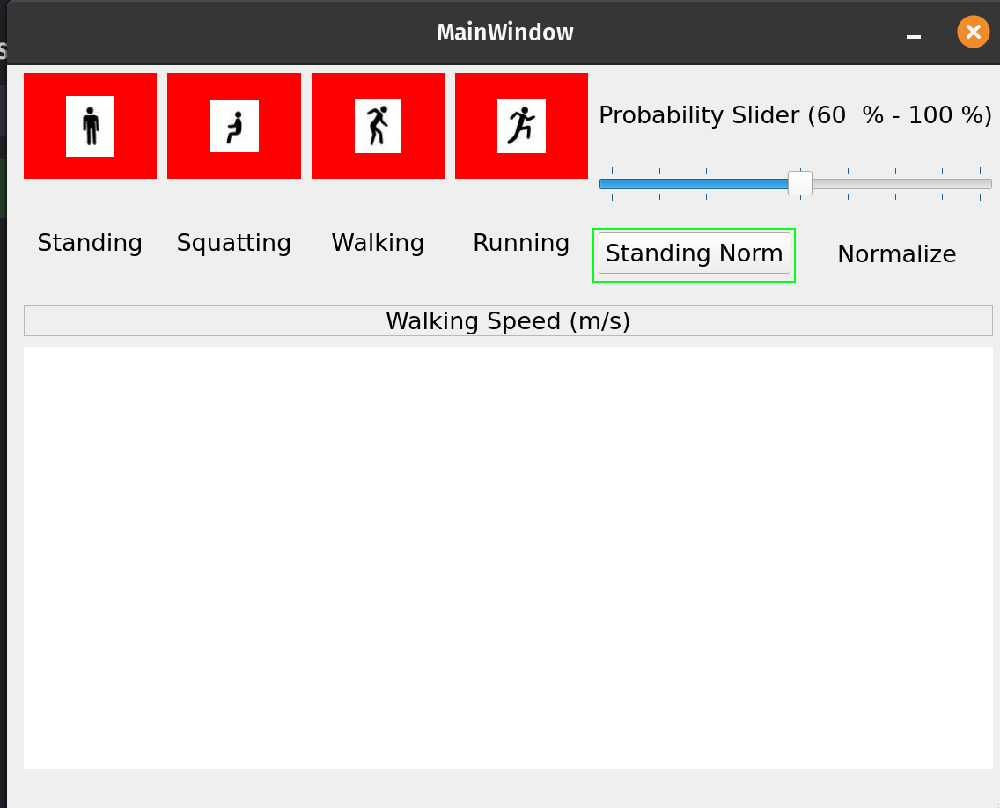

# Thesis Speed Estimation

## Setup

1. Install python either through anaconda or python.org.
2. Clone this repository either through git or by downloading the zip file.
3. Open a terminal or cmd window and navigate to the repository.
4. Install the required packages: `pip install -r requirements.txt`

## Running

Running activity classification and speed estimation has two steps, first is collecting the polar data. Second is running the activity and speed estimation code.

### Collect the Polar data.
1. Open a command window in windows or terminal in mac/linux. Navigate to the repository and run the following command:
```
python search_polar.py
```
This will search for polar H10 and store its address in the `polar.yml` file.

2. Start the polar data collection
3. Run the following command:
```
python collect_polar.py
```
This will start the data collection and start two pylsl streams `polar ECG` and `polar ACC`. 
Please check if these stream are created in `lab-recorder`.

### Run the activity and speed estimation code
1. Open a command window in windows or terminal in mac/linux. Navigate to the repository and run the following command:
```
python main.py
```
You will see the following window appear.


Please **press Normalize button while standing still for 5s.** Then click again to deselect it.
The normalize button is shown in the figure below.


Then you activity classification should be working.

Once the activity classification is working, then you can start working the speed estimation will start automatically.

## Troubleshooting
- Please email me: Prakyath Kantharaju <pkanth3@uic.edu> anytime, you need assitance.

## Problems
- The Speed estimation range is from 1 m/s to 1.5 m/s.
- The speed estimation is not tested for the overgound walking.
